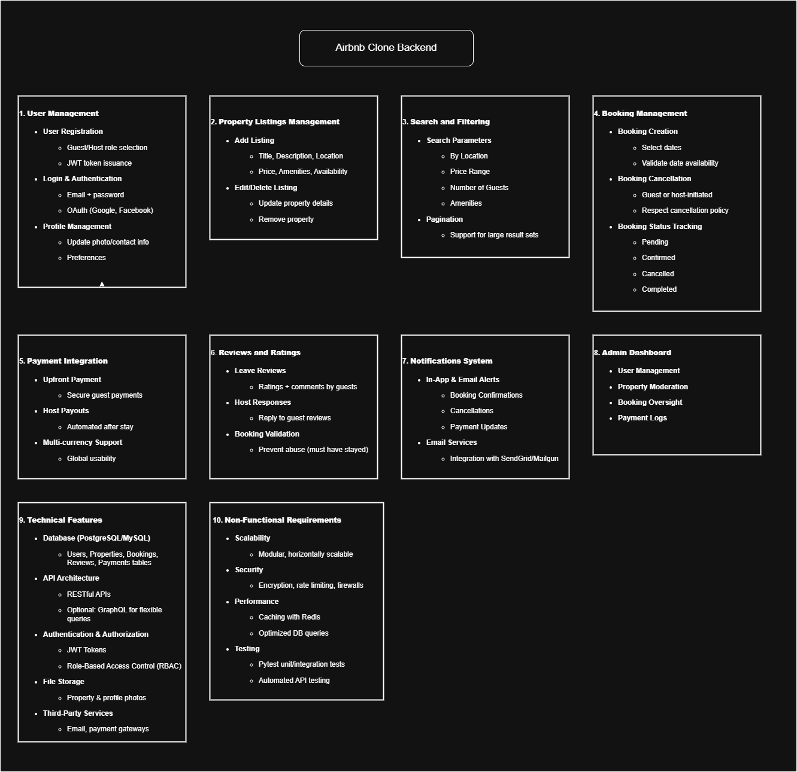

# Features and Functionalities – Airbnb Clone Backend

This document outlines the key features and functionalities that the backend of the Airbnb Clone project is required to support. The objective is to deliver a scalable, secure, and robust backend that powers the core user experience of an online rental marketplace.

## Overview

The backend must handle operations such as user authentication, property management, bookings, payments, and more. These features are essential for ensuring that the application functions reliably for both hosts and guests.

---

## Feature Breakdown Diagram

The following diagram provides a visual summary of the main features and their subcomponents:

---

## Main Feature Areas

- **User Management**  
  Handles user registration (guest/host roles), authentication (JWT/OAuth), and profile updates.

- **Property Listings Management**  
  Allows hosts to add, edit, and remove listings with detailed property data such as location, price, amenities, and availability.

- **Search and Filtering**  
  Enables users to search properties based on filters like location, price, amenities, and guest capacity.

- **Booking Management**  
  Allows guests to book properties, manage reservations, handle cancellations, and track booking statuses.

- **Payment Integration**  
  Implements secure payment handling via Stripe/PayPal with automatic payouts to hosts and support for multiple currencies.

- **Reviews and Ratings**  
  Enables guests to submit reviews and ratings after a stay and allows hosts to respond.

- **Notifications System**  
  Provides email and in-app notifications for booking updates, cancellations, and payment confirmations.

- **Admin Dashboard**  
  A back-office panel for managing users, listings, bookings, and transactions.

- **Technical & Non-Functional Requirements**  
  Includes database design, REST/GraphQL APIs, authentication/authorization (RBAC), caching, testing, security, and scalability measures.
